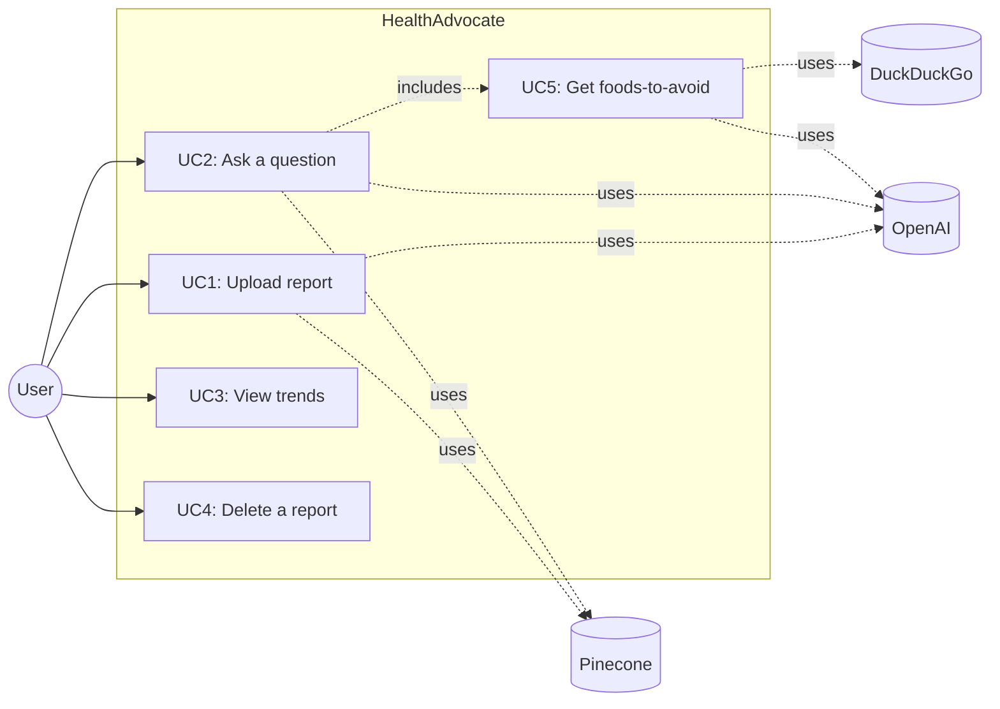
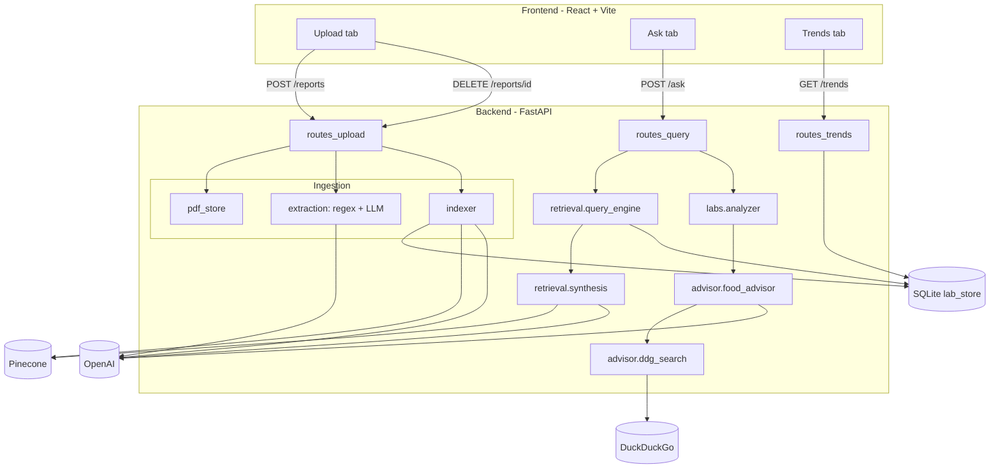
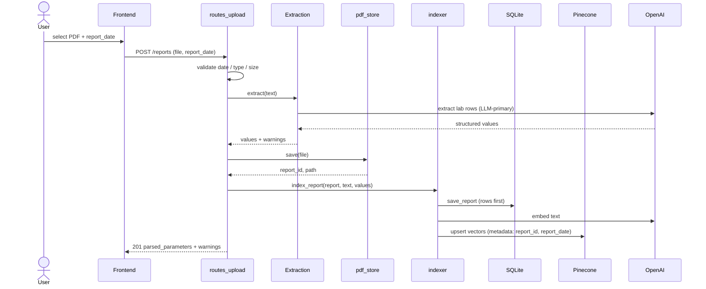
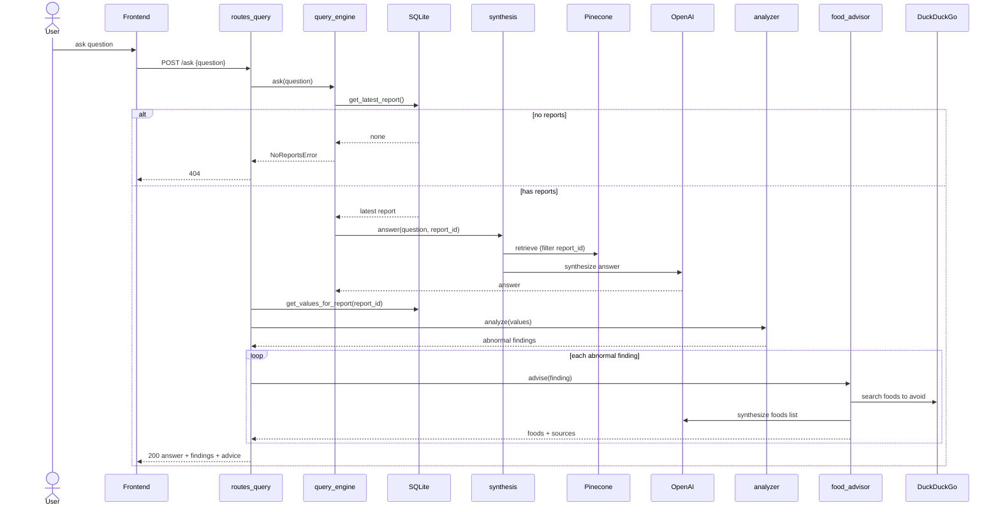
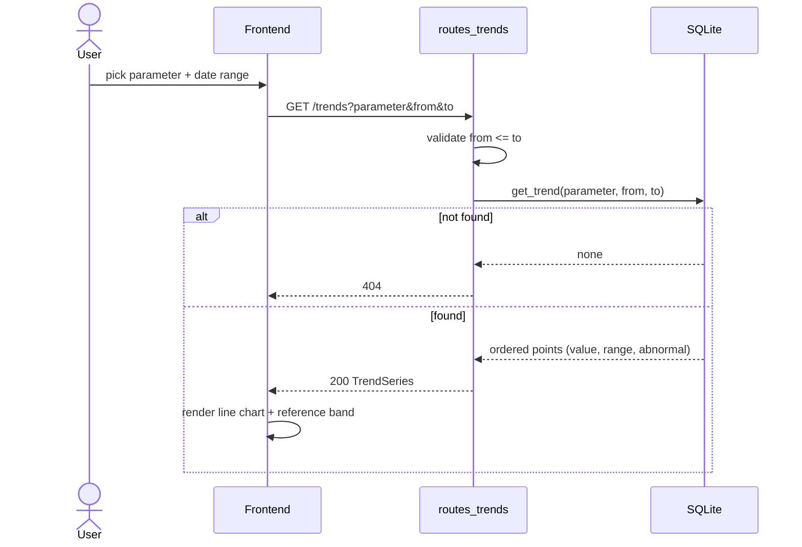
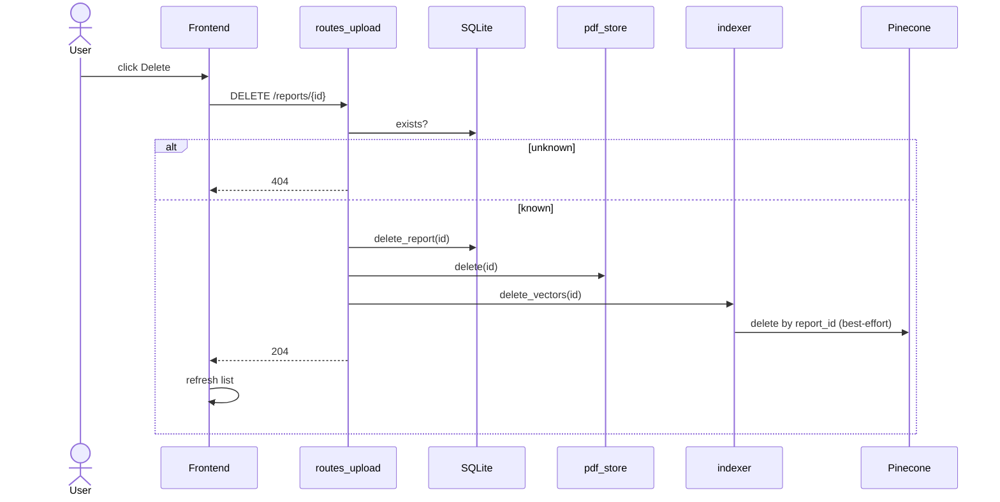

# HealthAdvocate — Project Documentation

A production-grade RAG application for personal bloodwork analysis. Users upload lab
report PDFs, ask natural-language questions about their results, visualize how individual
attributes trend over time, and — when a value falls outside its reference range — receive
live, web-sourced guidance on foods to avoid for that specific parameter.

> ⚠️ **Not medical advice.** Informational tool only. See [SAFETY_DISCLAIMER.md](SAFETY_DISCLAIMER.md).

This document consolidates the use cases, architecture, sequence flows, technical stack,
and lessons learned. For deeper detail see [ARCHITECTURE.md](ARCHITECTURE.md),
[DATA_FLOW.md](DATA_FLOW.md), and [API.md](API.md).

---

## 1. Use Cases

### Actors

| Actor | Description |
|-------|-------------|
| **User** (patient) | Uploads bloodwork PDFs, asks questions, views trends, deletes reports. |
| **OpenAI** (external) | Embeddings, answer synthesis, and structured lab-value extraction. |
| **Pinecone** (external) | Vector store for semantic retrieval. |
| **DuckDuckGo** (external) | Live web search for dietary guidance. |

### Use-case overview

### UC1 — Upload a bloodwork report

- **Goal:** Store a PDF and make it queryable and chartable.
- **Preconditions:** User has a PDF; backend running with valid OpenAI + Pinecone keys.
- **Main flow:**
  1. User selects a PDF and enters the **report date** (blood-draw date).
  2. System validates the date (not future) and file type (PDF, within size limit).
  3. System extracts text, then extracts structured lab rows (LLM-primary, regex fallback).
  4. System stores the PDF, writes structured rows to SQLite, embeds text into Pinecone.
  5. System returns parsed parameters + warnings (e.g. parameters with no range).
- **Alternate flows:** invalid/future date → `400`; non-PDF → `400`; oversized → `413`;
  unreadable PDF → `400`. If the vector step fails, structured rows are still persisted.
- **Postconditions:** report appears in the list; values are available for analysis/trends.

### UC2 — Ask a question

- **Goal:** Get a grounded answer about the latest report, with abnormal findings + advice.
- **Preconditions:** at least one report uploaded.
- **Main flow:**
  1. User submits a question.
  2. System resolves the **latest report** (`max(report_date)`, `uploaded_at` tiebreaker).
  3. System retrieves chunks from Pinecone filtered to that report and synthesizes an answer.
  4. System runs deterministic abnormality analysis over that report's structured values.
  5. For each abnormal value (UC5), it fetches foods-to-avoid.
  6. System returns the answer + findings + advice.
- **Alternate flows:** no reports → `404`; upstream LLM/search failure → degrades gracefully.

### UC3 — View trends

- **Goal:** Chart one parameter over a date range.
- **Main flow:** user picks a parameter and optional date range → system returns an ordered
  time series from SQLite with reference bounds and abnormal flags → UI renders a line chart
  with the reference band shaded and out-of-range points highlighted.
- **Alternate flows:** unknown parameter → `404`; `from > to` → `400`.

### UC4 — Delete a report

- **Goal:** Remove a report completely.
- **Main flow:** user clicks Delete → system removes SQLite rows + the PDF file, then
  best-effort deletes the Pinecone vectors → list refreshes.
- **Alternate flows:** unknown id → `404`; vector deletion failure is logged but non-fatal.

### UC5 — Get foods-to-avoid (included by UC2)

- **Goal:** For an abnormal parameter, produce a cited list of foods to avoid.
- **Main flow:** build a direction-aware query (high → "lower"; low → "when low") →
  live DuckDuckGo search → LLM synthesizes a concise list from the snippets → returns foods
  + source links. Triggered **only** for flagged parameters; no results → empty, no error.

---

## 2. Architecture

Two cooperating stores, a conditional agentic branch, and injectable seams around every
networked dependency.

**Why two stores**

| Store | Holds | Serves |
|-------|-------|--------|
| **Pinecone** | Embedded text chunks + metadata | Semantic Q&A (Ask) |
| **SQLite** | Structured `parameter, value, unit, report_date, ref_low, ref_high` | Trends + deterministic abnormality analysis |

**Key principles**
- Abnormality detection is **deterministic** (value vs printed range), never LLM-judged.
- `report_date` (user input) is authoritative for recency and the trend axis.
- Web augmentation is **conditional and bounded** — only for flagged parameters.
- Every networked dependency sits behind an **injectable seam** for testability.
- Reference ranges are **never invented** — absent ranges yield "no range available".

---

## 3. Sequence Diagrams

### 3.1 Upload & index

### 3.2 Ask (with conditional food advice)

### 3.3 Trends

### 3.4 Delete

---

## 4. Technical Stack

| Layer | Technology | Version | Rationale |
|-------|-----------|---------|-----------|
| Language (backend) | Python | 3.12 | Modern typing, performance |
| API framework | FastAPI | 0.115 | Async, dependency injection, OpenAPI docs |
| ASGI server | Uvicorn | 0.32 | Standard FastAPI server |
| RAG / indexing | LlamaIndex | 0.12 | Mature RAG primitives, Pinecone + OpenAI integrations |
| Vector store | Pinecone | 5.x | Managed vector DB, metadata filtering |
| Embeddings + LLM | OpenAI | 1.54 | `text-embedding-3-small` (1536-d) + GPT-4-class synthesis/extraction |
| Agentic web search | LangChain + ddgs | 0.3 / 9.x | DuckDuckGo needs no API key; LangChain scopes the advisor |
| Structured store | SQLite | stdlib | Exact/ordered queries for trends + analysis |
| Validation/config | Pydantic / pydantic-settings | 2.9 | Typed models + fail-fast settings |
| PDF parsing | pypdf | 5.1 | Text extraction |
| Frontend | React | 19 | Component model |
| Build tool | Vite | 6 | Fast dev/build, code-splitting |
| Charts | Recharts | 2.13 | Declarative charts; lazy-loaded to protect bundle budget |
| Language (frontend) | TypeScript | 5.6 | Type safety against the API contract |
| Lint | ruff (py), eslint (ts) | — | Code quality |
| Tests | pytest (+cov) | 8.3 | 63 tests, ~86% coverage on core logic |
| Container | Docker + Compose | — | Reproducible local run |

---

## 5. Lessons Learned

Captured from the actual build and debugging of this project.

### Engineering

1. **Silent fallbacks hide real failures.** A broad `except Exception` in the LLM
   extractor swallowed a fatal error and silently degraded every upload to a noisy regex
   path — producing garbage rows that *looked* like successful parses. Fix: log loudly on
   fallback, and fail visibly during development. A bad fallback is worse than a crash.

2. **`str.format()` and literal braces don't mix.** The LLM prompt contained a literal
   JSON example `{"values": ...}`; passing it through `.format()` raised `KeyError` on
   every call. Build prompts by concatenation (or escape braces). Added a regression test.

3. **Pin to the live package name.** `duckduckgo-search` was renamed to `ddgs`; the old
   package silently returned zero results. Only a live run surfaced it — unit tests with
   mocks never would. Lesson: a thin live smoke test for each external dependency is worth
   the cost.

4. **Deterministic where it matters, LLM where it helps.** Abnormality detection is a pure
   value-vs-range comparison (auditable, testable). The LLM is used only to *read* messy
   tables into structured rows. Keeping the trust-critical decision out of the LLM is the
   single most important correctness choice.

5. **Regex-first fallback was the wrong default.** Gating the LLM on "regex found nothing"
   meant a few junk regex matches suppressed the LLM entirely. Real lab PDFs are too varied
   for regex. Flipping to **LLM-primary with regex as a safety net** (plus union of extras)
   made extraction reliable. One LLM call per upload is an acceptable cost.

6. **Injectable seams pay off.** Every networked dependency (vector write/delete, synthesis,
   search, extraction) sits behind a protocol/callable. The suite runs with zero network and
   ~86% coverage, and live paths were swapped in only at the edges.

7. **Two stores beat one.** Forcing semantic search to also answer "plot sodium over 6
   months" would have been painful. Pinecone for meaning, SQLite for exact/ordered numeric
   queries — each does what it's good at.

### Data & domain

8. **Distinguish data dates from system dates.** `report_date` (user-entered blood-draw
   date) is authoritative for "latest report" and the trend axis; `uploaded_at` is only a
   tiebreaker. A report uploaded late must not masquerade as the most recent.

9. **Never invent reference ranges.** Ranges come only from the report. Missing range →
   `range_available = false`, excluded from abnormality detection. Honest gaps over
   confident guesses for health-adjacent output.

10. **Lab parameter names are messy.** Reports contain "Creatinine", "Creatinine, Urine",
    "BUN/Creatinine Ratio". Exact-name matching for trends is brittle; tolerant matching is
    a known future improvement.

### Operational

11. **Wrong interpreter, wrong everything.** `ModuleNotFoundError` came from Anaconda's
    `uvicorn` shadowing the venv on `PATH`. Lesson: invoke the venv binary explicitly
    (`.venv/bin/uvicorn`) rather than relying on PATH/activation.

12. **State lives in the database, not the filesystem.** Deleting PDF files by hand left
    orphaned DB rows still showing in the UI. This drove the proper `DELETE /reports/{id}`
    endpoint that removes all three stores together.

13. **The Pinecone dimension must match the embedding model.** `text-embedding-3-small` is
    1536-d; a mismatched index rejects upserts. Easy to get wrong on first setup.

---

## 6. Future Improvements

- **Tolerant parameter matching** for trends (substring/alias map) so `creatinine` matches
  `Creatinine, Serum`.
- **Multi-report "trend mode"** in the Ask tab (currently single latest report).
- **Per-report parameter picker** in the Trends tab (discoverable instead of free-text).
- **OCR fallback** for scanned/image-only PDFs.
- **ID-based Pinecone deletion** for serverless indexes (filter-delete is pod-only).
- **Authentication + multi-user isolation** before any shared deployment.
- **Live smoke test in CI** exercising the real OpenAI/Pinecone/DuckDuckGo paths.
